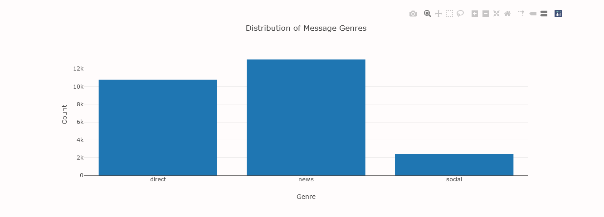

## Project Overview <a name="Project-Overview"></a>
Disaster Response Pipeline App project is part of the Udacity Data Science Nano Degree. This project builds a Natural Language Processing (NLP) for classification of disaster messages into various categories. There is also a provision for emergency classification of a disaster message, wherein one can input a message and direct it to the appropriate organization/team upon its classification. 


## Instructions <a name="How-To-Run-This-Project"></a>
### 1. Download the files or clone this repository
  ```
  git clone https://github.com/Gagankaurgill/Disaster-Response-App.git
  ```
### 2. Execute the scripts
a. Open a terminal <br>
b. Direct to the project's root directory <br>
c. Run the following commands: <br>
- To run ETL pipeline that cleans data and stores in database
  ```
  python data/process_data.py data/disaster_messages.csv data/disaster_categories.csv data/DisasterResponse.db
  ```
- To run ML pipeline that trains classifier and saves
  ```
  python models/train_classifier.py data/DisasterResponse.db models/classifier.pkl
  ```

d. Go to the app's directory and run the command
```sh
cd app
python run.py
```
e. The web app is hosted at: http://0.0.0.0:3001/ or http://localhost:3001/ 

f. Input any message in the input box and click on the Classify Message button to see the categories that the message may belong to.


## Project Components

There are three components you'll need to complete for this project.
### 1. ETL Pipeline

Python script process_data.py is a data cleaning pipeline that:

    Loads the messages and categories datasets
    Merges the two datasets
    Cleans the data
    Stores it in a SQLite database

### 2. ML Pipeline

Python script train_classifier.py writes a machine learning pipeline that:

    Loads data from the SQLite database
    Splits the dataset into training and test sets
    Builds a text processing and machine learning pipeline
    Trains and tunes a model using GridSearchCV
    Outputs results on the test set
    Exports the final model as a pickle file

### 3. Flask Web App
Flask Application has two main features
1. It provides visualizations of the data provided for the project.
2. It also allows a user to enter a message and determine its category classification. 


Figure 1. Input field takes in new messages.


Figure 2. Distribution of Message Genres.


Figure 3. Distribution of Message Categories.


Figure 4. Distribution of Message based on Genres .


Figure 5. Sample Message for Classification


Figure 5. Sample Message Category Classification

## File Structure
An overview of folders and files structure for the app

```
│   README.md
│
├───app
│   │   run.py
│   │
│   └───templates
│           go.html
│           master.html
│
├───data
│       DisasterResponse.db
│       disaster_categories.csv
│       disaster_messages.csv
│       process_data.py
│
└───models
        classifier.pkl
        train_classifier.py

```


